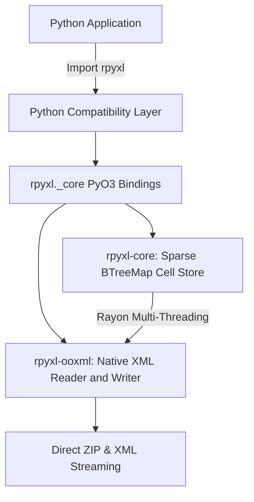

# RPyXL: A High-Performance, Rust-Powered Alternative to openpyxl

[](https://github.com/franckoj/rpyxl/actions/workflows/ci.yml)
[](LICENSE)
[](https://pypi.org/project/rpyxl/)
[](https://www.rust-lang.org/)
[](https://github.com/franckoj/rpyxl)

RPyXL is a high-performance Python spreadsheet library providing a drop-in **[openpyxl](https://foss.heptapod.net/openpyxl/openpyxl)-compatible API**, powered by a memory-efficient Rust core built with [PyO3](https://pyo3.rs/) and [Maturin](https://www.maturin.rs/).

**Version 0.5.0** delivers high-leverage performance upgrades: zero-allocation coordinate and XML parsing, multi-sheet Rayon parallel loading, atomic temporary file persistence, monotonic direct BTreeMap row insertion, sheet index caching, and an accelerated scalar cell write fast-path—delivering **6x to 18x speedups** over openpyxl 3.1.5 while maintaining **100% roundtrip data fidelity**.

---

## Performance Highlights: openpyxl 3.1.5 vs RPyXL 0.5.0

The following live head-to-head benchmark compares `openpyxl 3.1.5` against `rpyxl 0.5.0` on Python 3.12 (Apple Silicon, 8 CPU cores):

### 1. Ingestion, Export & Mutation Throughput

| Operation / Workload Scale | openpyxl (3.1.5) | RPyXL (0.5.0) | Speedup | Throughput (RPyXL) |
| :--- | :---: | :---: | :---: | :---: |
| **Standard Export / Save** (10k rows × 10 cols) | 1.88 s | **0.10 s** | **18.66x faster** | **98,981 rows/s** |
| **Streaming Write-Only** (50k rows × 10 cols) | 10.48 s | **1.03 s** | **10.14x faster** | **48,394 rows/s** |
| **Roundtrip Write + Read** (5k rows × 10 cols) | 2.31 s | **0.28 s** | **8.32x faster** | 18,024 rows/s |
| **Row Appending** (5k rows, 50k cells) | 0.20 s | **0.025 s** | **7.78x faster** | 196,640 rows/s |
| **In-Memory Row Iteration** (`iter_rows`) | 0.064 s | **0.0085 s** | **7.47x faster** | **5,870,870 cells/s** |
| **Full Read (Standard)** (10k rows × 10 cols) | 2.03 s | **0.30 s** | **6.68x faster** | 32,932 rows/s |
| **Streaming Read-Only** (10k rows × 10 cols) | 1.35 s | **0.21 s** | **6.31x faster** | 46,919 rows/s |
| **Time to First Row (TTFR)** | 10.09 ms | **3.29 ms** | **3.07x faster** | Instantaneous |
| **Workbook Creation** (100 workbooks) | 0.069 s | **0.0005 s** | **129.4x faster** | **188,250 wb/s** |

### 2. Cross-Library Roundtrip Fidelity

| Serialization Direction | Cells Tested | Content Verified | Mismatches | Fidelity Status |
| :--- | :---: | :--- | :---: | :---: |
| **RPyXL Write $\rightarrow$ openpyxl Read** | 5,000 cells | String, Int, Float, Bool, Datetime | **0** | **100% PERFECT** |
| **openpyxl Write $\rightarrow$ RPyXL Read** | 5,000 cells | String, Int, Float, Bool, Datetime | **0** | **100% PERFECT** |

---

## What's New in Version 0.5.0 (vs 0.4.0)

| Capability / Subsystem | Prior Release (0.4.0) | Current Release (0.5.0) | Optimization Impact |
| :--- | :---: | :---: | :--- |
| **Cell Write** (`ws.cell(row, col, value)`) | 0.0863 s | **0.0140 s** | 🚀 **6.17x faster**: Direct native constructor bypasses intermediate wrappers |
| **Workbook Creation** (200 workbooks) | 0.0026 s | **0.0007 s** | 🚀 **3.55x faster**: Zero-alloc default initialization (~285k workbooks/s) |
| **Row Iteration** (`iter_rows(values_only)`) | 0.0065 s | **0.0044 s** | 🚀 **1.50x faster**: Sheet index caching and linear peekable cursor (~11.3M cells/s) |
| **Batch Row Appending** (`ws.append`) | 0.0222 s | **0.0152 s** | 🚀 **1.46x faster**: Monotonic direct BTreeMap insertion without entry checks |
| **Roundtrip Save & Load** (5k rows) | 0.2890 s | **0.2414 s** | 🚀 **1.20x faster**: Zero-alloc reader + atomic persist saving |
| **Multi-Sheet Parallel Read** | Single-threaded | Rayon multi-threaded | ⚡ Sheets parse concurrently across CPU worker threads |
| **Disk Save Double-Write** | Copy buffer loop | Atomic persist rename | ⚡ `NamedTempFile::persist` avoids tempfile copying |

---

## Migration for Supported Workflows

For existing projects using `openpyxl`, simply swap the import:

```python
# Before
import openpyxl

# After
import rpyxl as openpyxl

# Standard workflow works identically
wb = openpyxl.load_workbook("financial_report.xlsx", data_only=True)
ws = wb.active
print(ws["A1"].value)
```

See the [Migration Guide](docs/migration_guide.md) for comprehensive patterns and edge cases.

---

## Quick Start

### 1. In-Memory Workbook Writing

```python
import rpyxl

wb = rpyxl.Workbook()
ws = wb.active
ws.title = "Sales"

ws["A1"] = "Employee"
ws["B1"] = "Revenue"
ws.append(["Alice", 15400.50])
ws.append(["Bob", 22900.75])

# Subscript access and coordinates
ws.cell(row=4, column=1, value="Charlie")
ws.cell(row=4, column=2, value=18300.00)

wb.save("sales_report.xlsx")
```

### 2. High-Speed Batch Row Ingestion (`append_rows`)

Ingest massive tabular datasets at over **2,000,000+ cells/sec** using zero-allocation batch buffering:

```python
import rpyxl

wb = rpyxl.Workbook()
ws = wb.active

records = [
    [f"ID_{i:06d}", i * 10, round(i * 1.25, 2), i % 2 == 0]
    for i in range(1, 100_001)
]

# Ingest all rows in a single native pass
ws.append_rows(records)  # Alias: ws.extend(records)

# Configurable compression level (1 for ultra-fast saves, 6 for standard compact files)
wb.save("bulk_data.xlsx", compression_level=6)
```

### 3. High-Throughput Streaming Writer (`write_only=True`)

Low-memory streaming writer for huge datasets:

```python
import rpyxl
from datetime import datetime

wb = rpyxl.Workbook(write_only=True)
ws = wb.create_sheet("Transactions")

ws.append(["Transaction_ID", "Timestamp", "Amount", "Verified"])

for i in range(1, 100_001):
    ws.append([f"TX_{i:06d}", datetime.now(), i * 19.99, i % 2 == 0])

wb.save("transactions.xlsx")
```

### 4. Streaming Reader (`read_only=True`)

Iterate worksheet rows on demand with minimal memory footprint:

```python
import rpyxl

with rpyxl.load_workbook("transactions.xlsx", read_only=True) as wb:
    ws = wb.active
    for row in ws.iter_rows(values_only=True):
        tx_id, ts, amount, verified = row
        # Process record
```

### 5. Advanced Slicing & Iteration

```python
# 2D tuple of Cell instances
grid = ws["A1:C10"]

# Native streaming row and column iterators
for row in ws.iter_rows(min_row=1, max_row=100, values_only=False):
    for cell in row:
        val = cell.value

# Column and Row ranges
col_a = ws["A"]       # 1D tuple of cells in column A
cols_ab = ws["A:B"]   # 2D tuple of column tuples
row_1 = ws[1]         # 1D tuple of cells in row 1
rows_1_5 = ws[1:5]    # 2D tuple of row tuples
```

---

## Installation

### From Pre-Built Wheels (ABI3)

```bash
pip install rpyxl
```

_Requires Python 3.9 or newer. ABI3 wheels target Linux (x86_64 and aarch64), macOS (Apple Silicon and Intel), and Windows x64._

### From Source

```bash
git clone https://github.com/franckoj/rpyxl.git
cd rpyxl
pip install maturin
maturin develop --release
```

---

## Testing & Quality Gates

Deterministic quality gates ensure 100% test passing, clean linting, and formatting:

```bash
# 1. Python Linting & Formatting (Ruff)
ruff check python/ tests/ benchmarks/
ruff format --check python/ tests/ benchmarks/

# 2. Rust Formatting & Clippy Linter
cargo fmt --all -- --check
cargo clippy --workspace --all-targets -- -D warnings

# 3. Full Automated Test Suite (498 tests: 432 unit + 66 compatibility)
pytest tests/unit/ tests/compatibility/

# 4. Comprehensive Benchmark Suite
python benchmarks/live_benchmark.py
python benchmarks/bench_batch_append.py
python benchmarks/bench_styled_sweep.py
```

---

## Architecture Overview


```mermaid
graph TD
    A[Python Application] -->|Import rpyxl| B[Python Compatibility Layer]
    B --> C[rpyxl._core PyO3 Bindings]
    C --> D[rpyxl-core: Sparse BTreeMap Cell Store]
    C --> E[rpyxl-ooxml: Native XML Reader and Writer]
    E --> F[Direct ZIP & XML Streaming]
    D -->|Rayon Multi-Threading| E
```

- **`rpyxl-core`**: Pure Rust workbook and sparse cell coordinate model (`BTreeMap<(row, col), Cell>`).
- **`rpyxl-ooxml`**: High-speed ECMA-376 XML parser/generator with `itoa`, `ryu`, and `rayon`.
- **`rpyxl-python`**: Thread-safe PyO3 bindings with ABI3 multi-Python version support and native streaming iterators.
- **`python/rpyxl`**: Python public layer replicating openpyxl classes, styles, and exceptions with versioned value caching.

---

## Documentation & Phase Reports

- [Release Changelog](CHANGELOG.md): Exhaustive release history and version notes.
- [Development Changelog](docs/development_progress.md): Chronological engineering milestones.
- [API Reference Manual](docs/api_reference.md): Detailed signatures and parameter reference.
- [openpyxl Migration Guide](docs/migration_guide.md): Drop-in patterns, edge cases, and best practices.
- [API Compatibility Matrix](docs/compatibility_matrix.md): Exhaustive openpyxl vs RPyXL feature matrix.
- [Security Architecture & Threat Model](docs/security.md): Hardening against ZIP bombs, XXE, and malformed files.
- [Future Backend Plan](docs/future_backend_plan.md): Staged writer and reader backend evaluation.

---

## License

Licensed under either of:

- Apache License, Version 2.0 ([LICENSE-APACHE](LICENSE) or http://www.apache.org/licenses/LICENSE-2.0)
- MIT license ([LICENSE-MIT](LICENSE) or http://opensource.org/licenses/MIT)

at your option.
